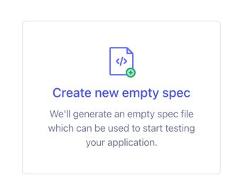

# Making-of

Those are the steps that lead to the current state of this repository.

```shell
npm init vue@latest
```

> Follow the prompts to create your app. During the setup, you will be asked if you would like to install Cypress. You can do so now or in the next step.

```

Vue.js - The Progressive JavaScript Framework

✔ Project name: … vue3-vite-cypress-e2e-component
✔ Add TypeScript? … Yes
✔ Add JSX Support? … No
✔ Add Vue Router for Single Page Application development? Yes
✔ Add Pinia for state management? Yes
✔ Add Vitest for Unit Testing? … No  ⚠️ for this example cypress will be used for component testing (vitest may be used or not later for unit testing)
✔ Add Cypress for both Unit and End-to-End testing? … No (we try to configure from npx cypress open interactive setup)
✔ Add ESLint for code quality? … Yes
✔ Add Prettier for code formatting? … Yes

Scaffolding project in starters/vue3-vite-cypress-e2e-component...

Done. Now run:

  cd vue3-vite-cypress-e2e-component
  npm install
  npm run lint
  npm run dev

```

## IDE support

- Jetbrains IDEs
  - Install Cypress Support Plugin

## Install cypress for vuejs / vite / e2e / component testing

Quickstart officiel: https://docs.cypress.io/guides/component-testing/quickstart-vue

```shell
npm install cypress -D
```


Interactive (GUI) setup for cypress

```shell
npx cypress open
```


Click on "Not Configured" Button on the "E2E Testing" Panel.


Click on Continue

Choose a browser


I this case let's choose Electron.


Start E2E Testing in Electron.


"Create your first spec" window.


Choose "Scaffold example specs"


Recap of added files.


Click "Okay, I got it!"


Click on "1-getting-started" / "todo.cy.js".

It should run a test against a live todo app.


Run of the spec should be OK.


## Checkpoint

Verify the app still builds and runs.

```shell
npm run build
```

```shell
npm run preview
```

```shell
npm run dev
```

## Setup Cypress Component test runner

```shell
npx cypress open
```


Now that E2E testing base configuration has been set, "E2E Testing" Panel shows "Configured"


On "Component Testing" Panel, click on "Not Configured" button.


In the project Setup window, Front-end framework and Bundler should be detected.

- Front-end framework: Vue.js 3
- Bundler (Dev Server): Vite


Click on "Next Step" button.


Install Dev Dependencies Window


The following dev dependencies should be installed

- vite `^=2.0.0 || ^=3.0.0`
- vue `^3.0.0`
- typescript `>=3.0.0`

Click on "Continue" button.


Configuration Files Window recap.


Click on "Continue" button

Choose a browser window


Let's Choose Electron
Click on "Start Component Testing in Electron"


Create your first spec Window


Click on "Create a new empty spec"



Enter the path for your new spec.

`cypress/component/HelloWorld.cy.ts`


Click on "Create Spec" button.


Spec successfully added window recap


Click on "Okay, run the spec"


Spec run result.
Since there is nothing tested, it just verifies the minimal configuration works.


## First component test with cypress component runner

https://docs.cypress.io/guides/component-testing/mounting-vue

Modify `cypress/component/HelloWorld.cy.ts`

```ts

import HelloWorld from '@/components/HelloWorld.vue'

describe('<HelloWorld>', () => {
  it('mounts', () => {
    cy.mount(HelloWorld)
  })
})
```

Run the spec in cypress GUI.

```shell
npx cypress open --component
```


Click on HelloWorld spec

Specs runs results window.


Test should have been fast.

Exit cypress GUI.

## Checkpoint

Run Cypress tests in non interactive mode (headless browser by default)

```shell
npx cypress run
```

E2E tests should be run successfully (it may take some time).

Test results summary may look like the following:

```

  (Run Finished)


       Spec                                              Tests  Passing  Failing  Pending  Skipped  
  ┌────────────────────────────────────────────────────────────────────────────────────────────────┐
  │ ✔  todo.cy.js                               00:02        6        6        -        -        - │
  ├────────────────────────────────────────────────────────────────────────────────────────────────┤
  │ ✔  actions.cy.js                            00:13       14       14        -        -        - │
  ├────────────────────────────────────────────────────────────────────────────────────────────────┤
  │ ✔  aliasing.cy.js                           00:01        2        2        -        -        - │
  ├────────────────────────────────────────────────────────────────────────────────────────────────┤
  │ ✔  assertions.cy.js                         00:03        9        9        -        -        - │
  ├────────────────────────────────────────────────────────────────────────────────────────────────┤
  │ ✔  connectors.cy.js                         00:01        8        8        -        -        - │
  ├────────────────────────────────────────────────────────────────────────────────────────────────┤
  │ ✔  cookies.cy.js                            00:01        5        5        -        -        - │
  ├────────────────────────────────────────────────────────────────────────────────────────────────┤
  │ ✔  cypress_api.cy.js                        00:02       12       12        -        -        - │
  ├────────────────────────────────────────────────────────────────────────────────────────────────┤
  │ ✔  files.cy.js                              00:01        4        4        -        -        - │
  ├────────────────────────────────────────────────────────────────────────────────────────────────┤
  │ ✔  local_storage.cy.js                      00:01        1        1        -        -        - │
  ├────────────────────────────────────────────────────────────────────────────────────────────────┤
  │ ✔  location.cy.js                           00:01        3        3        -        -        - │
  ├────────────────────────────────────────────────────────────────────────────────────────────────┤
  │ ✔  misc.cy.js                               00:03        6        6        -        -        - │
  ├────────────────────────────────────────────────────────────────────────────────────────────────┤
  │ ✔  navigation.cy.js                         00:02        3        3        -        -        - │
  ├────────────────────────────────────────────────────────────────────────────────────────────────┤
  │ ✔  network_requests.cy.js                   00:04        6        6        -        -        - │
  ├────────────────────────────────────────────────────────────────────────────────────────────────┤
  │ ✔  querying.cy.js                           00:02        5        5        -        -        - │
  ├────────────────────────────────────────────────────────────────────────────────────────────────┤
  │ ✔  spies_stubs_clocks.cy.js                 00:04        7        7        -        -        - │
  ├────────────────────────────────────────────────────────────────────────────────────────────────┤
  │ ✔  traversal.cy.js                          00:02       18       18        -        -        - │
  ├────────────────────────────────────────────────────────────────────────────────────────────────┤
  │ ✔  utilities.cy.js                          00:02        5        5        -        -        - │
  ├────────────────────────────────────────────────────────────────────────────────────────────────┤
  │ ✔  viewport.cy.js                           00:03        1        1        -        -        - │
  ├────────────────────────────────────────────────────────────────────────────────────────────────┤
  │ ✔  waiting.cy.js                            00:05        2        2        -        -        - │
  ├────────────────────────────────────────────────────────────────────────────────────────────────┤
  │ ✔  window.cy.js                             00:01        3        3        -        -        - │
  └────────────────────────────────────────────────────────────────────────────────────────────────┘
    ✔  All specs passed!                        01:04      120      120        -        -        -  


```


## Run component tests non interactively

```shell
npx cypress run --component
```

Component test results should run sucessfully (relly fast)

Result may look like the following:

```
  (Results)

  ┌────────────────────────────────────────────────────────────────────────────────────────────────┐
  │ Tests:        1                                                                                │
  │ Passing:      1                                                                                │
  │ Failing:      0                                                                                │
  │ Pending:      0                                                                                │
  │ Skipped:      0                                                                                │
  │ Screenshots:  0                                                                                │
  │ Video:        false                                                                            │
  │ Duration:     0 seconds                                                                        │
  │ Spec Ran:     HelloWorld.cy.ts                                                                 │
  └────────────────────────────────────────────────────────────────────────────────────────────────┘


====================================================================================================

  (Run Finished)


       Spec                                              Tests  Passing  Failing  Pending  Skipped  
  ┌────────────────────────────────────────────────────────────────────────────────────────────────┐
  │ ✔  HelloWorld.cy.ts                          48ms        1        1        -        -        - │
  └────────────────────────────────────────────────────────────────────────────────────────────────┘
    ✔  All specs passed!                         48ms        1        1        -        -        -  


```

There may be a warning that can cause to slow down the command execution.

```

Warning: We failed processing this video.

This error will not alter the exit code.

TimeoutError: operation timed out
    at afterTimeout (/Users/marco/Library/Caches/Cypress/10.4.0/Cypress.app/Contents/Resources/app/packages/server/node_modules/bluebird/js/release/timers.js:46:19)
    at Timeout.timeoutTimeout [as _onTimeout] (/Users/marco/Library/Caches/Cypress/10.4.0/Cypress.app/Contents/Resources/app/packages/server/node_modules/bluebird/js/release/timers.js:76:13)
    at listOnTimeout (node:internal/timers:559:17)
    at processTimers (node:internal/timers:502:7)

```

Let's disable video recording for component testing.

```ts
import {defineConfig} from "cypress";

export default defineConfig({
    e2e: {
        setupNodeEvents(on, config) {
            // implement node event listeners here
        },
    },

    component: {
        devServer: {
            framework: "vue",
            bundler: "vite",
        },
        video: false // <---- Here
    },
});

```

Now test should pass without warning.


```shell
npx cypress run --component
```

Full report may look like the following

```
====================================================================================================

(Run Starting)

┌────────────────────────────────────────────────────────────────────────────────────────────────┐
│ Cypress:        10.4.0                                                                         │
│ Browser:        Electron 102 (headless)                                                        │
│ Node Version:   v16.14.2 (/Users/marco/.volta/tools/image/node/16.14.2/bin/node)               │
│ Specs:          1 found (HelloWorld.cy.ts)                                                     │
│ Searched:       **/*.cy.{js,jsx,ts,tsx}                                                        │
└────────────────────────────────────────────────────────────────────────────────────────────────┘


────────────────────────────────────────────────────────────────────────────────────────────────────

Running:  HelloWorld.cy.ts                                                                (1 of 1)


  <HelloWorld>
    ✓ mounts (29ms)


1 passing (46ms)


(Results)

┌────────────────────────────────────────────────────────────────────────────────────────────────┐
│ Tests:        1                                                                                │
│ Passing:      1                                                                                │
│ Failing:      0                                                                                │
│ Pending:      0                                                                                │
│ Skipped:      0                                                                                │
│ Screenshots:  0                                                                                │
│ Video:        false                                                                            │
│ Duration:     0 seconds                                                                        │
│ Spec Ran:     HelloWorld.cy.ts                                                                 │
└────────────────────────────────────────────────────────────────────────────────────────────────┘


====================================================================================================

(Run Finished)


       Spec                                              Tests  Passing  Failing  Pending  Skipped  
┌────────────────────────────────────────────────────────────────────────────────────────────────┐
│ ✔  HelloWorld.cy.ts                          44ms        1        1        -        -        - │
└────────────────────────────────────────────────────────────────────────────────────────────────┘
✔  All specs passed!                         44ms        1        1        -        -        -  


```

## Config files checkpoint

At this point, the package.json file looks like this:

```json
{
  "name": "vue3-vite-cypress-e2e-component",
  "version": "0.0.0",
  "scripts": {
    "dev": "vite",
    "build": "run-p type-check build-only",
    "preview": "vite preview --port 4173",
    "build-only": "vite build",
    "type-check": "vue-tsc --noEmit",
    "lint": "eslint . --ext .vue,.js,.jsx,.cjs,.mjs,.ts,.tsx,.cts,.mts --fix --ignore-path .gitignore"
  },
  "dependencies": {
    "pinia": "^2.0.16",
    "vue": "^3.2.37",
    "vue-router": "^4.1.2"
  },
  "devDependencies": {
    "@rushstack/eslint-patch": "^1.1.0",
    "@types/node": "^16.11.45",
    "@vitejs/plugin-vue": "^3.0.1",
    "@vue/eslint-config-prettier": "^7.0.0",
    "@vue/eslint-config-typescript": "^11.0.0",
    "@vue/tsconfig": "^0.1.3",
    "cypress": "^10.4.0",
    "eslint": "^8.5.0",
    "eslint-plugin-vue": "^9.0.0",
    "npm-run-all": "^4.1.5",
    "prettier": "^2.5.1",
    "typescript": "~4.7.4",
    "vite": "^3.0.1",
    "vue-tsc": "^0.38.8"
  }
}

```

`.eslintrc.cjs`

```js
/* eslint-env node */
require("@rushstack/eslint-patch/modern-module-resolution");

module.exports = {
  "root": true,
  "extends": [
    "plugin:vue/vue3-essential",
    "eslint:recommended",
    "@vue/eslint-config-typescript/recommended",
    "@vue/eslint-config-prettier"
  ]
}

```

`.gitignore`

```
# Logs
logs
*.log
npm-debug.log*
yarn-debug.log*
yarn-error.log*
pnpm-debug.log*
lerna-debug.log*

node_modules
.DS_Store
dist
dist-ssr
coverage
*.local

/cypress/videos/
/cypress/screenshots/

# Editor directories and files
.vscode/*
!.vscode/extensions.json
.idea
*.suo
*.ntvs*
*.njsproj
*.sln
*.sw?

```

`cypress.config.ts`

```ts
import {defineConfig} from "cypress";

export default defineConfig({
    e2e: {
        setupNodeEvents(on, config) {
            // implement node event listeners here
        },
    },

    component: {
        devServer: {
            framework: "vue",
            bundler: "vite",
        },
        video: false
    },
});

```

`env.d.ts`

```ts
/// <reference types="vite/client" />

```

`index.html`

```html
<!DOCTYPE html>
<html lang="en">
  <head>
    <meta charset="UTF-8" />
    <link rel="icon" href="/favicon.ico" />
    <meta name="viewport" content="width=device-width, initial-scale=1.0" />
    <title>Vite App</title>
  </head>
  <body>
    <div id="app"></div>
    <script type="module" src="/src/main.ts"></script>
  </body>
</html>

```

`tsconfig.config.json`

```json
{
  "extends": "@vue/tsconfig/tsconfig.node.json",
  "include": ["vite.config.*", "vitest.config.*", "cypress.config.*"],
  "compilerOptions": {
    "composite": true,
    "types": ["node"]
  }
}

```

`tsconfig.json`

```json
{
  "extends": "@vue/tsconfig/tsconfig.web.json",
  "include": ["env.d.ts", "src/**/*", "src/**/*.vue"],
  "compilerOptions": {
    "baseUrl": ".",
    "paths": {
      "@/*": ["./src/*"]
    }
  },

  "references": [
    {
      "path": "./tsconfig.config.json"
    }
  ]
}

```

`vite.config.ts`

```ts
import { fileURLToPath, URL } from 'node:url'

import { defineConfig } from 'vite'
import vue from '@vitejs/plugin-vue'

// https://vitejs.dev/config/
export default defineConfig({
  plugins: [vue()],
  resolve: {
    alias: {
      '@': fileURLToPath(new URL('./src', import.meta.url))
    }
  }
})

```

`src/main.ts`

```ts
import { createApp } from 'vue'
import { createPinia } from 'pinia'

import App from './App.vue'
import router from './router'

import './assets/main.css'

const app = createApp(App)

app.use(createPinia())
app.use(router)

app.mount('#app')

```

`src/App.vue`

```html
<script setup lang="ts">
import { RouterLink, RouterView } from 'vue-router'
import HelloWorld from './components/HelloWorld.vue'
</script>

<template>
  <header>
    

    <div class="wrapper">
      <HelloWorld msg="You did it!" />

      <nav>
        <RouterLink to="/">Home</RouterLink>
        <RouterLink to="/about">About</RouterLink>
      </nav>
    </div>
  </header>

  <RouterView />
</template>

<style scoped>
header {
  line-height: 1.5;
  max-height: 100vh;
}

.logo {
  display: block;
  margin: 0 auto 2rem;
}

nav {
  width: 100%;
  font-size: 12px;
  text-align: center;
  margin-top: 2rem;
}

nav a.router-link-exact-active {
  color: var(--color-text);
}

nav a.router-link-exact-active:hover {
  background-color: transparent;
}

nav a {
  display: inline-block;
  padding: 0 1rem;
  border-left: 1px solid var(--color-border);
}

nav a:first-of-type {
  border: 0;
}

@media (min-width: 1024px) {
  header {
    display: flex;
    place-items: center;
    padding-right: calc(var(--section-gap) / 2);
  }

  .logo {
    margin: 0 2rem 0 0;
  }

  header .wrapper {
    display: flex;
    place-items: flex-start;
    flex-wrap: wrap;
  }

  nav {
    text-align: left;
    margin-left: -1rem;
    font-size: 1rem;

    padding: 1rem 0;
    margin-top: 1rem;
  }
}
</style>

```

`cypress/support/commands.ts`

```ts
/// <reference types="cypress" />
// ***********************************************
// This example commands.ts shows you how to
// create various custom commands and overwrite
// existing commands.
//
// For more comprehensive examples of custom
// commands please read more here:
// https://on.cypress.io/custom-commands
// ***********************************************
//
//
// -- This is a parent command --
// Cypress.Commands.add('login', (email, password) => { ... })
//
//
// -- This is a child command --
// Cypress.Commands.add('drag', { prevSubject: 'element'}, (subject, options) => { ... })
//
//
// -- This is a dual command --
// Cypress.Commands.add('dismiss', { prevSubject: 'optional'}, (subject, options) => { ... })
//
//
// -- This will overwrite an existing command --
// Cypress.Commands.overwrite('visit', (originalFn, url, options) => { ... })
//
// declare global {
//   namespace Cypress {
//     interface Chainable {
//       login(email: string, password: string): Chainable<void>
//       drag(subject: string, options?: Partial<TypeOptions>): Chainable<Element>
//       dismiss(subject: string, options?: Partial<TypeOptions>): Chainable<Element>
//       visit(originalFn: CommandOriginalFn, url: string, options: Partial<VisitOptions>): Chainable<Element>
//     }
//   }
// }
```

`cypress/support/component.ts`

```ts
// ***********************************************************
// This example support/component.ts is processed and
// loaded automatically before your test files.
//
// This is a great place to put global configuration and
// behavior that modifies Cypress.
//
// You can change the location of this file or turn off
// automatically serving support files with the
// 'supportFile' configuration option.
//
// You can read more here:
// https://on.cypress.io/configuration
// ***********************************************************

// Import commands.js using ES2015 syntax:
import './commands'

// Alternatively you can use CommonJS syntax:
// require('./commands')

import { mount } from 'cypress/vue'

// Augment the Cypress namespace to include type definitions for
// your custom command.
// Alternatively, can be defined in cypress/support/component.d.ts
// with a <reference path="./component" /> at the top of your spec.
declare global {
  namespace Cypress {
    interface Chainable {
      mount: typeof mount
    }
  }
}

Cypress.Commands.add('mount', mount)

// Example use:
// cy.mount(MyComponent)
```

`cypress/support/component-index.html`

```html
<!DOCTYPE html>
<html>
  <head>
    <meta charset="utf-8">
    <meta http-equiv="X-UA-Compatible" content="IE=edge">
    <meta name="viewport" content="width=device-width,initial-scale=1.0">
    <title>Components App</title>
  </head>
  <body>
    <div data-cy-root></div>
  </body>
</html>
```

`cypress/support/e2e.ts`

```ts
// ***********************************************************
// This example support/e2e.ts is processed and
// loaded automatically before your test files.
//
// This is a great place to put global configuration and
// behavior that modifies Cypress.
//
// You can change the location of this file or turn off
// automatically serving support files with the
// 'supportFile' configuration option.
//
// You can read more here:
// https://on.cypress.io/configuration
// ***********************************************************

// Import commands.js using ES2015 syntax:
import './commands'

// Alternatively you can use CommonJS syntax:
// require('./commands')
```

## Add vuetify but don't use it yet

```shell
vue add vuetify
```

```

📦  Installing vue-cli-plugin-vuetify...


up to date, audited 407 packages in 1s

99 packages are looking for funding
  run `npm fund` for details

found 0 vulnerabilities
✔  Successfully installed plugin: vue-cli-plugin-vuetify

? Choose a preset: Vite Preview (Vuetify 3 + Vite)

🚀  Invoking generator for vue-cli-plugin-vuetify...
 WARN  conflicting versions for project dependency "@vitejs/plugin-vue":
       
       - ^3.0.1 injected by generator "undefined"
       - ^2.0.0 injected by generator "vue-cli-plugin-vuetify"
       
       Using newer version (^3.0.1), but this may cause build errors.
 WARN  conflicting versions for project dependency "vite":
       
       - ^3.0.1 injected by generator "undefined"
       - ^2.0.0 injected by generator "vue-cli-plugin-vuetify"
       
       Using newer version (^3.0.1), but this may cause build errors.
📦  Installing additional dependencies...


added 18 packages, and audited 425 packages in 7s

103 packages are looking for funding
  run `npm fund` for details

found 0 vulnerabilities
⚓  Running completion hooks...

✔  Successfully invoked generator for plugin: vue-cli-plugin-vuetify
 vuetify  Discord community: https://community.vuetifyjs.com
 vuetify  Github: https://github.com/vuetifyjs/vuetify
 vuetify  Support Vuetify: https://github.com/sponsors/johnleider


```
We just installed Vuetify.

Let's cleanup our code so that vuetify is not used yet in the application but still installed.

I rolled back every file to their previous version **but not the following**
- package.json
- vite.config.ts
- vue3-vite-cypress-e2e-component/src/shims-vuetify.d.ts
- vue3-vite-cypress-e2e-component/src/styles/_variables.scss
- vue3-vite-cypress-e2e-component/src/plugins/vuetify.ts
- vue3-vite-cypress-e2e-component/src/plugins/webfontloader.ts

This means the new content of these files are.

Here is a tricky part.
Lots of dependencies have to be updated manually.

New `package.json`

```json
{
  "name": "vue3-vite-cypress-e2e-component",
  "version": "0.0.0",
  "scripts": {
    "dev": "vite",
    "build": "run-p type-check build-only",
    "preview": "vite preview --port 4173",
    "build-only": "vite build",
    "serve": "vite preview",
    "type-check": "vue-tsc --noEmit",
    "lint": "eslint . --ext .vue,.js,.jsx,.cjs,.mjs,.ts,.tsx,.cts,.mts --fix --ignore-path .gitignore"
  },
  "dependencies": {
    "@mdi/font": "^7.0.96",
    "pinia": "^2.0.16",
    "roboto-fontface": "*",
    "vue": "^3.2.37",
    "vue-router": "^4.1.3",
    "vuetify": "^3.0.0-beta.6",
    "webfontloader": "^1.6.28"
  },
  "devDependencies": {
    "@rushstack/eslint-patch": "^1.1.0",
    "@types/node": "^16.11.45",
    "@types/webfontloader": "^1.6.34",
    "@vitejs/plugin-vue": "^3.0.1",
    "@vue/eslint-config-prettier": "^7.0.0",
    "@vue/eslint-config-typescript": "^11.0.0",
    "@vue/tsconfig": "^0.1.3",
    "cypress": "^10.4.0",
    "eslint": "^8.5.0",
    "eslint-plugin-vue": "^9.0.0",
    "npm-run-all": "^4.1.5",
    "prettier": "^2.5.1",
    "typescript": "~4.7.4",
    "vite": "^3.0.1",
    "vite-plugin-vuetify": "^1.0.0-alpha.14",
    "vue-cli-plugin-vuetify": "^2.5.1",
    "vue-tsc": "^0.38.8"
  }
}

```

`vite.config.ts`

```ts
import { fileURLToPath, URL } from 'node:url'

import { defineConfig } from 'vite'
import vue from '@vitejs/plugin-vue'

// https://github.com/vuetifyjs/vuetify-loader/tree/next/packages/vite-plugin
import vuetify from 'vite-plugin-vuetify'

// https://vitejs.dev/config/
export default defineConfig({
    plugins: [
        vue(),
        vuetify({ autoImport: true }),
    ],
    resolve: {
        alias: {
            '@': fileURLToPath(new URL('./src', import.meta.url))
        }
    }
})

```

`vue3-vite-cypress-e2e-component/src/shims-vuetify.d.ts`

```ts
declare module 'vuetify'
declare module 'vuetify/lib/components'
declare module 'vuetify/lib/directives'
```

`vue3-vite-cypress-e2e-component/src/styles/_variables.scss`

```scss
// Place SASS variable overrides here
// $font-size-root: 18px;
```


`vue3-vite-cypress-e2e-component/src/plugins/vuetify.ts`

```ts
// Styles
import '@mdi/font/css/materialdesignicons.css'
import 'vuetify/styles'

// Vuetify
import { createVuetify } from 'vuetify'

export default createVuetify(
  // https://vuetifyjs.com/en/introduction/why-vuetify/#feature-guides
)
```


`vue3-vite-cypress-e2e-component/src/plugins/webfontloader.ts`

```ts
/**
 * plugins/webfontloader.js
 *
 * webfontloader documentation: https://github.com/typekit/webfontloader
 */

export async function loadFonts () {
  const webFontLoader = await import(/* webpackChunkName: "webfontloader" */'webfontloader')

  webFontLoader.load({
    google: {
      families: ['Roboto:100,300,400,500,700,900&display=swap'],
    },
  })
}

```

No other file is to be added or modified.

You'd better delete the node_modules folder and install all again.

```shell
rm -fr node_modules
npm i
```

Make sure everything still works.

```shell
npm run build-only
npm run build
npm run serve
npm run preview
# Check in your browser : site should work (and no errors or warnings in the console)
npm run dev
# Check in your browser : site should work (and no errors or warnings in the console)
npx cypress run --component
# Should pass with no warning logs
npx cypress run --e2e
npm run type-check
```


## Fix linter issues

```shell
npm run lint
```

A lot (hundreds) of errors like the following:

```
   76:5   error  'cy' is not defined            no-undef
   77:5   error  'cy' is not defined            no-undef
   78:5   error  'cy' is not defined            no-undef

```

```shell
npm i -D eslint-plugin-cypress
npm run lint
```

Way less errors and warnings.

> ✖ 24 problems (20 errors, 4 warnings)

```
> vue3-vite-cypress-e2e-component@0.0.0 lint
> eslint . --ext .vue,.js,.jsx,.cjs,.mjs,.ts,.tsx,.cts,.mts --fix --ignore-path .gitignore


vue3-vite-cypress-e2e-component/cypress.config.ts
  5:21  warning  'on' is defined but never used      @typescript-eslint/no-unused-vars
  5:25  warning  'config' is defined but never used  @typescript-eslint/no-unused-vars

vue3-vite-cypress-e2e-component/cypress/e2e/2-advanced-examples/cypress_api.cy.js
  35:14  warning  '$button' is defined but never used  @typescript-eslint/no-unused-vars

vue3-vite-cypress-e2e-component/cypress/e2e/2-advanced-examples/files.cy.js
  5:25  error  'require' is not defined  no-undef

vue3-vite-cypress-e2e-component/cypress/e2e/2-advanced-examples/misc.cy.js
  94:30  error  Unexpected empty method 'onBeforeScreenshot'  @typescript-eslint/no-empty-function
  95:29  error  Unexpected empty method 'onAfterScreenshot'   @typescript-eslint/no-empty-function

vue3-vite-cypress-e2e-component/cypress/e2e/2-advanced-examples/spies_stubs_clocks.cy.js
  11:13  error  Unexpected empty method 'foo'  @typescript-eslint/no-empty-function

vue3-vite-cypress-e2e-component/cypress/e2e/2-advanced-examples/utilities.cy.js
  89:44  warning  'reject' is defined but never used  @typescript-eslint/no-unused-vars

vue3-vite-cypress-e2e-component/cypress/e2e/2-advanced-examples/viewport.cy.js
  29:5  error  Do not wait for arbitrary time periods  cypress/no-unnecessary-waiting
  31:5  error  Do not wait for arbitrary time periods  cypress/no-unnecessary-waiting
  33:5  error  Do not wait for arbitrary time periods  cypress/no-unnecessary-waiting
  35:5  error  Do not wait for arbitrary time periods  cypress/no-unnecessary-waiting
  37:5  error  Do not wait for arbitrary time periods  cypress/no-unnecessary-waiting
  39:5  error  Do not wait for arbitrary time periods  cypress/no-unnecessary-waiting
  41:5  error  Do not wait for arbitrary time periods  cypress/no-unnecessary-waiting
  43:5  error  Do not wait for arbitrary time periods  cypress/no-unnecessary-waiting
  45:5  error  Do not wait for arbitrary time periods  cypress/no-unnecessary-waiting
  47:5  error  Do not wait for arbitrary time periods  cypress/no-unnecessary-waiting
  52:5  error  Do not wait for arbitrary time periods  cypress/no-unnecessary-waiting
  54:5  error  Do not wait for arbitrary time periods  cypress/no-unnecessary-waiting

vue3-vite-cypress-e2e-component/cypress/e2e/2-advanced-examples/waiting.cy.js
  13:5  error  Do not wait for arbitrary time periods  cypress/no-unnecessary-waiting
  15:5  error  Do not wait for arbitrary time periods  cypress/no-unnecessary-waiting
  17:5  error  Do not wait for arbitrary time periods  cypress/no-unnecessary-waiting

vue3-vite-cypress-e2e-component/cypress/support/component.ts
  29:3  error  ES2015 module syntax is preferred over custom TypeScript modules and namespaces  @typescript-eslint/no-namespace

✖ 24 problems (20 errors, 4 warnings)

```

Lots of errors come from `cypress/e2e/2-advanced-examples/**`
Since we plan to delete them after we learn from them, we will exclude them from lint (it is not our tests, it is samples we don't own).

`.eslintrc.cjs`

```js
/* eslint-env node */
require("@rushstack/eslint-patch/modern-module-resolution");

module.exports = {
    root: true,
    extends: [
        "plugin:vue/vue3-essential",
        "eslint:recommended",
        "@vue/eslint-config-typescript/recommended",
        "@vue/eslint-config-prettier",
        "plugin:cypress/recommended",
    ],
    ignorePatterns: ["cypress/e2e/2-advanced-examples/**"] // <---- Here
};
```

```shell
npm run lint
```

We are now down to 3 errors:

```
> vue3-vite-cypress-e2e-component@0.0.0 lint
> eslint . --ext .vue,.js,.jsx,.cjs,.mjs,.ts,.tsx,.cts,.mts --fix --ignore-path .gitignore


vue3-vite-cypress-e2e-component/cypress.config.ts
  5:21  warning  'on' is defined but never used      @typescript-eslint/no-unused-vars
  5:25  warning  'config' is defined but never used  @typescript-eslint/no-unused-vars

vue3-vite-cypress-e2e-component/cypress/support/component.ts
  29:3  error  ES2015 module syntax is preferred over custom TypeScript modules and namespaces  @typescript-eslint/no-namespace

✖ 3 problems (1 error, 2 warnings)

```

`cypress.config.ts`

```ts
import { defineConfig } from "cypress";

export default defineConfig({
  e2e: {
    setupNodeEvents() {
      // implement node event listeners here
    },
  },
  component: {
    devServer: {
      framework: "vue",
      bundler: "vite",
    },
    video: false,
  },
});

```

```shell
npx cypress run --component
npx cypress run --e2e
```


`cypress/support/component.ts`

Add `/* eslint-disable @typescript-eslint/no-namespace */` before `global namespace` ...
We need keep this `Chainable` interface to add `mount` function to Cypress.

It allows us to write things such as `cy.mount(HelloWorld);` in our component tests.


```shell
npm run lint
```

Lint should pass.

## Fix some IDE errors

```shell
npm i --save-dev @types/jest
```

We should now have support and completion for implicit imports of `describe`, `it` ... in `cypress/component/HelloWorld.cy.ts`.

## Setup vuetify for component tests


We now want to check cypress capability to test a single vuetify component (still not added to the App).

The lines below are a try to create a special mount command for components using vuetify 3 and vue 3
It does not work yet.


`cypress/support/component-index.html`

Add `id="__cy_root"` on the root `<div>`.

```html
<!DOCTYPE html>
<html>
  <head>
    <meta charset="utf-8">
    <meta http-equiv="X-UA-Compatible" content="IE=edge">
    <meta name="viewport" content="width=device-width,initial-scale=1.0">
    <title>Components App</title>
  </head>
  <body>
    <div id="__cy_root"
         data-cy-root></div>
  </body>
</html>
```

`cypress/support/component.ts`

Create a custom mount function that surrounds the mounted component with a vuetify app wrapper. It also adds vuetify as plugin. (credits: https://github.com/elevatebart/cy-ct-vuetify)

```ts
// ***********************************************************
// This example support/component.ts is processed and
// loaded automatically before your test files.
//
// This is a great place to put global configuration and
// behavior that modifies Cypress.
//
// You can change the location of this file or turn off
// automatically serving support files with the
// 'supportFile' configuration option.
//
// You can read more here:
// https://on.cypress.io/configuration
// ***********************************************************

// Import commands.js using ES2015 syntax:
import "./commands";

// Alternatively you can use CommonJS syntax:
// require('./commands')

import {mount} from "cypress/vue";

// Augment the Cypress namespace to include type definitions for
// your custom command.
// Alternatively, can be defined in cypress/support/component.d.ts
// with a <reference path="./component" /> at the top of your spec.

/* eslint-disable @typescript-eslint/no-namespace */
declare global {
  namespace Cypress {
    interface Chainable {
      mount: typeof mount;
    }
  }
}

import vuetify from "@/plugins/vuetify";
import {loadFonts} from '@/plugins/webfontloader'

loadFonts()

Cypress.Commands.add("mount", (MountedComponent, options) => {

    const root = document.getElementById("__cy_root");
    // Vuetify styling
    if (!root.classList.contains("v-application")) {
        root.classList.add("v-application");
    }
    // Vuetify selector used for popup elements to attach to the DOM
    root.setAttribute('data-app', 'true');

    return mount(MountedComponent, {
        global: {
            plugins: [vuetify]
        },
        ...options, // To override values for specific tests
    });
});
```

## let's test a single vuetify component


`cypress/component/ATextField.cy.ts`

Create a new component test.
This time, the tested component will rely on a `<v-text-field>`, whinch depends on vuetify.

```ts
/// <reference types="cypress" />
import ATextField from "@/components/ATextField.vue";

describe("<ATextField>", () => {
  it("mounts", () => {
    cy.mount(ATextField);
  });
});
```

`src/components/ATextField.vue`

The component to test. It uses `<v-text-field>` that is a component from vuetify.

```html
<script setup lang="ts"></script>

<template>
  <v-text-field></v-text-field>
</template>

<style></style>
```

```shell
npm run test:component
```

Tests should run successfully and be pretty fast.

```

> starter-vue3-vuetify3-vite-cypress-component-e2e@0.0.0 test:component
> cypress run --component


====================================================================================================

  (Run Starting)

  ┌────────────────────────────────────────────────────────────────────────────────────────────────┐
  │ Cypress:        10.4.0                                                                         │
  │ Browser:        Electron 102 (headless)                                                        │
  │ Node Version:   v16.14.2 (/Users/marco/.volta/tools/image/node/16.14.2/bin/node)               │
  │ Specs:          2 found (ATextField.cy.ts, HelloWorld.cy.ts)                                   │
  │ Searched:       **/*.cy.{js,jsx,ts,tsx}                                                        │
  └────────────────────────────────────────────────────────────────────────────────────────────────┘


────────────────────────────────────────────────────────────────────────────────────────────────────
                                                                                                    
  Running:  ATextField.cy.ts                                                                (1 of 2)


  <ATextField>
    ✓ mounts (70ms)


  1 passing (86ms)


  (Results)

  ┌────────────────────────────────────────────────────────────────────────────────────────────────┐
  │ Tests:        1                                                                                │
  │ Passing:      1                                                                                │
  │ Failing:      0                                                                                │
  │ Pending:      0                                                                                │
  │ Skipped:      0                                                                                │
  │ Screenshots:  0                                                                                │
  │ Video:        false                                                                            │
  │ Duration:     0 seconds                                                                        │
  │ Spec Ran:     ATextField.cy.ts                                                                 │
  └────────────────────────────────────────────────────────────────────────────────────────────────┘


────────────────────────────────────────────────────────────────────────────────────────────────────
                                                                                                    
  Running:  HelloWorld.cy.ts                                                                (2 of 2)


  <HelloWorld>
    ✓ mounts (57ms)


  1 passing (73ms)


  (Results)

  ┌────────────────────────────────────────────────────────────────────────────────────────────────┐
  │ Tests:        1                                                                                │
  │ Passing:      1                                                                                │
  │ Failing:      0                                                                                │
  │ Pending:      0                                                                                │
  │ Skipped:      0                                                                                │
  │ Screenshots:  0                                                                                │
  │ Video:        false                                                                            │
  │ Duration:     0 seconds                                                                        │
  │ Spec Ran:     HelloWorld.cy.ts                                                                 │
  └────────────────────────────────────────────────────────────────────────────────────────────────┘


====================================================================================================

  (Run Finished)


       Spec                                              Tests  Passing  Failing  Pending  Skipped  
  ┌────────────────────────────────────────────────────────────────────────────────────────────────┐
  │ ✔  ATextField.cy.ts                          81ms        1        1        -        -        - │
  ├────────────────────────────────────────────────────────────────────────────────────────────────┤
  │ ✔  HelloWorld.cy.ts                          69ms        1        1        -        -        - │
  └────────────────────────────────────────────────────────────────────────────────────────────────┘
    ✔  All specs passed!                        150ms        2        2        -        -        -  

```


## Configure App.vue with vuetify

Now that we now we can test components, we can convert our app so it can use vuetify components.

`src/main.ts`

```ts
import { createApp } from "vue";
import { createPinia } from "pinia";
import App from "./App.vue";
import router from "./router";
import "@/assets/main.css";
import vuetify from '@/plugins/vuetify'
import { loadFonts } from './plugins/webfontloader'

loadFonts()

const app = createApp(App);

app.use(createPinia());
app.use(router);
app.use(vuetify);

app.mount("#app");
```

`src/App.vue`

```html
<script setup lang="ts">
  import {RouterLink, RouterView} from "vue-router";
  import HelloWorld from "./components/HelloWorld.vue";
  import ATextField from "@/components/ATextField.vue";
</script>

<template>
  <!--
  v-app root component wrapper is required for children components
  that relies on vuetify
  -->
  <v-app>
    <header>
      <div class="wrapper">
        <HelloWorld msg="You did it!"/>
        <!-- a component that relies on vuetify -->
        <ATextField/>
        <nav>
          <RouterLink to="/">Home</RouterLink>
          <RouterLink to="/about">About</RouterLink>
        </nav>
      </div>
    </header>
    <RouterView/>
  </v-app>
</template>

<style></style>
```

Let's cleanup the style so it does not clash with vuetify.

`src/assets/base.css`

```css
```

`src/assets/main.css`
```css
@import "./base.css";
```

`src/components/HelloWorld.vue`

```html
<script setup lang="ts">
defineProps<{
  msg: string;
}>();
</script>

<template>
  <p>Hello {{ msg }}</p>
</template>

<style scoped></style>
```

`src/views/HomeView.vue`

```html
<template>
  <main>
    Home
  </main>
</template>
```

`src/views/AboutView.vue`

```
<template>
  <main>
    About
  </main>
</template>
```

Let's remove files:
- `src/stores/counter.ts`
- `src/components/TheWelcome.vue`
- `src/components/WelcomeItem.vue`
- `src/components/icons`
- `src/assets/logo.svg`

Verify everything still compiles / lints / tests / runs.


```shell
npm run build-only
npm run build
npm run serve
npm run preview
# Check in your browser : site should work (and no errors or warnings in the console)
npm run dev
# Check in your browser : site should work (and no errors or warnings in the console)
npm run test:component
# Should pass with no warning logs
npm run test:e2e
npm run type-check
npm run lint
```

## A little more advanced test

`cypress/component/ATextField.cy.ts`

```ts
/// <reference types="cypress" />
import ATextField from "@/components/ATextField.vue";

describe("<ATextField>", () => {
  it("mounts",  () => {
    cy.mount(ATextField);
    cy.get('[data-cy="a-text-field"]').click()
    cy.get('[data-cy="a-text-field"]').type("Hello")
  });
});
```

`src/components/ATextField.vue`

```html
<script setup lang="ts"></script>

<template>
  <v-text-field
      label="Label"
      data-cy="a-text-field"
  ></v-text-field>
</template>

<style></style>
```

## Less verbose test reports

`package.json`

```json
{
  // ...
  "scripts": {
    // ...
    "test:component": "cypress run --quiet --component"
  },
  // ...
}
```


## TODO

<!-- TODO : after a break
- fix webstorm cypress integration
- test a few more complex components (with animation, labels, tables ...)
  - maybe create a mini find and interact cypress commands as helpers for common uses
- cypress watch mode : https://goodvuetests.substack.com/p/chapter-312-basic-test-setup-with
- e2e tests against the local application
- create some package.json scripts
- update readme.md with new scripts and useful information
- setup CI
- update readme.md with new scripts and useful information
- add testing library support
- assess if vitest may still be needed for unit testing (store, services ...)
- build some starter showcase for common vuetify testing scenarios
- tweak config files step by step for IDE best support

-->


